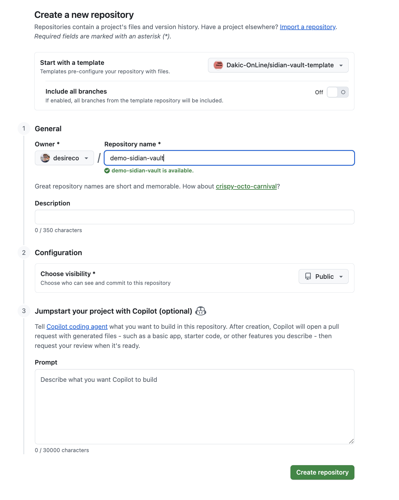
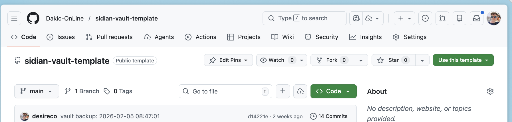

# Sidian Vault

A personal knowledge management and productivity system built on Obsidian. Combines daily journaling, goal tracking, and structured planning into one integrated system.

It is meant to be used with SidianSidekick service.

## Use This Template

This repository is a **GitHub template**. Click the green **"Use this template"** button above to create your own copy.



### Getting Started

1. Click **"Use this template"** → **"Create a new repository"**
2. Name your vault and click **"Create repository"**



3. Clone your new repo locally
4. Open the folder in Obsidian as a vault
5. Follow the **[SETUP.md](SETUP.md)** guide

> **Note**: You'll get all the folders, templates, and documentation. Personal content (diary entries, goals, etc.) is not included.

## Quick Start

**First time?** See **[SETUP.md](SETUP.md)** for complete installation and configuration instructions.

1. Open this folder as a vault in Obsidian
2. Start at `Home.md` - your personal dashboard
3. Read `Guide.md` for complete system documentation
4. Capture quick thoughts in `00_Inbox/Inbox.md`
5. Create your first daily entry in `02_Diary/`

## Folder Structure

```
00_Inbox/            # Quick capture for thoughts, ideas, assignments
01_ThinkingLines/     # Long-form thinking and conceptual notes
02_Diary/             # Daily journal entries (YYYY-MM-DD.md)
02_Longer_writes/    # Extended writing pieces
03_Goals/             # Long-term goals and their plans
  ├─ Archive/         # Inactive/paused goals
  └─ Developing/      # Goals being explored
30_Weekly_Plans/      # Weekly execution plans
31_Monthly_Reviews/   # Monthly reviews and goal adjustments
32_Quarterly_Strategy/ # Quarterly strategy and new goal creation
50_Reports/           # Generated reports
  ├─ Daily/           # Daily reports
  ├─ Research/        # Research reports
  └─ Review/          # Review reports
99_Assets/            # Templates
  └─ templates/       # All interval templates
```

## Core Concepts

### Planning Hierarchy

The system works on four time levels:

| Level | Folder | Purpose |
|-------|--------|---------|
| Quarterly | `32_Quarterly_Strategy/` | Set direction and create goals |
| Monthly | `31_Monthly_Reviews/` | Review progress and adjust |
| Weekly | `30_Weekly_Plans/` | Execute on daily tasks |
| Daily | `02_Diary/` | Journal and reflect |

### Goal System

Goals live in `03_Goals/` with three states:
- **Active**: In the main folder, tracked in reviews
- **Developing**: In `Developing/`, still exploring
- **Archived**: In `Archive/`, inactive but saved

Each goal has a companion plan file with actionable next steps.

### Inbox Processing

Use `00_Inbox/Inbox.md` to quickly capture thoughts. Tag each item:
- `#idea` - Concepts and possibilities
- `#note` - Observations and reflections
- `#action` - Things to implement
- `#review` - Request feedback
- `#research` - Deep dive needed

## Documentation

| File | Description |
|------|-------------|
| **[SETUP.md](SETUP.md)** | Installation, Obsidian setup, getting started |
| `Home.md` | Personal dashboard with quick links |
| `Guide.md` | Complete system documentation |
| `Guide - Tag System.md` | How to use tags effectively |
| `Guide - Properties.md` | Metadata for sorting and filtering |

## Features

- **Daily journaling** with pattern recognition
- **Goal tracking** with actionable plans
- **Weekly/Monthly/Quarterly** planning cycles
- **Inbox system** for quick capture and processing
- **Research & Review** tag processing
- **Developing folder** for exploring ideas before committing
- **Template system** for consistent note creation

## Recommended Plugins

- **Obsidian Git** - Version control backup
- **Dataview** - Query and visualize vault data (optional)
- **Templater** - Advanced templates (optional)

## License

MIT License - Feel free to use and modify for your own needs.
