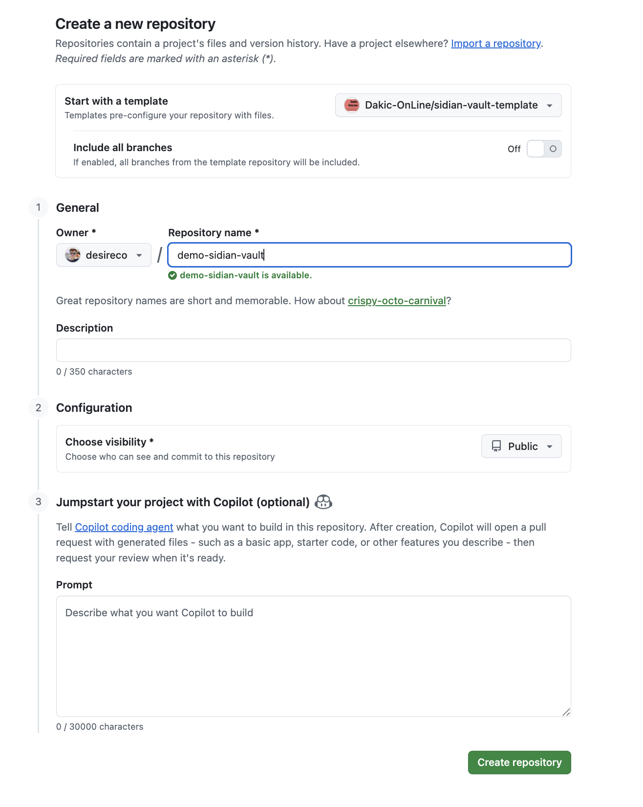
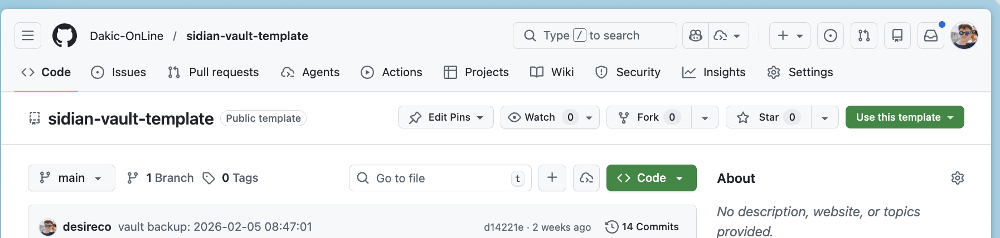

# Sidian Vault

A personal knowledge management and productivity system built on Obsidian. Combines daily journaling, goal tracking, and structured planning into one integrated system.

It is meant to be used with SidianSidekick service.

---

## Use This Template

This repository is a **GitHub template**. Click the green **"Use this template"** button above to create your own copy.



### Create Your Vault

1. Click **"Use this template"** → **"Create a new repository"**
2. Name your vault and click **"Create repository"**



3. Clone your new repo locally

> **Note**: You'll get all the folders, templates, and documentation. Personal content (diary entries, goals, etc.) is not included.

---

## Setup in Obsidian

### Step 1: Open as Vault

1. Open Obsidian
2. Click **"Open folder as vault"**
3. Select your cloned folder
4. Done

### Step 2: Configure Templates

1. Go to **Settings** → **Core Plugins** → Enable **Templates**
2. Go to **Settings** → **Templates**
3. Set **Template folder location**: `99_Assets/templates`

### Step 3: Install Obsidian Git (Recommended)

1. Go to **Settings** → **Community Plugins** → Turn off Restricted mode
2. Click **Browse** → Search "Obsidian Git" → Install
3. Configure auto-commit interval (e.g., 30 minutes)

---

## Quick Start

1. Open this folder as a vault in Obsidian
2. Start at `Home.md` - your personal dashboard
3. Read `Guide.md` for complete system documentation
4. Capture quick thoughts in `00_Inbox/Inbox.md`
5. Create your first daily entry in `01_Journal/`

## Folder Structure

```
00_Inbox/            # Quick capture for thoughts, ideas, assignments
01_Journal/          # Daily journal entries (YYYY-MM-DD.md)
02_MindSpace/        # Conceptual notes and thinking pieces
  └─ _LongWriting/   # Extended writing pieces and essays
03_Goals/            # Long-term goals and their plans
  ├─ Archive/        # Inactive/paused goals
  └─ Developing/     # Goals being explored
04_Planning/         # Weekly, Monthly, Quarterly plans
  ├─ 1_Weekly/       # Weekly execution plans
  ├─ 2_Monthly/      # Monthly reviews
  └─ 3_Quarterly/    # Quarterly strategy
50_Reports/          # Generated reports
  ├─ Daily/          # Daily reports
  ├─ Research/       # Research reports
  └─ Review/         # Review reports
99_Assets/           # Templates
  └─ templates/      # All interval templates
```

## Core Concepts

### Planning Hierarchy

The system works on four time levels:

| Level | Folder | Purpose |
|-------|--------|---------|
| Quarterly | `04_Planning/3_Quarterly/` | Set direction and create goals |
| Monthly | `04_Planning/2_Monthly/` | Review progress and adjust |
| Weekly | `04_Planning/1_Weekly/` | Execute on daily tasks |
| Daily | `01_Journal/` | Journal and reflect |

### Goal System

Goals live in `03_Goals/` with three states:
- **Active**: In the main folder, tracked in reviews
- **Developing**: In `Developing/`, still exploring
- **Archived**: In `Archive/`, inactive but saved

Each goal has a companion plan file with actionable next steps.

### Inbox Processing

Use `00_Inbox/Inbox.md` to quickly capture thoughts. Tag each item:
- `#idea` - Concepts and possibilities
- `#note` - Observations and reflections
- `#action` - Things to implement
- `#review` - Request feedback
- `#research` - Deep dive needed

## Documentation

| File | Description |
|------|-------------|
| `Home.md` | Personal dashboard with quick links |
| `Guide.md` | Complete system documentation |
| `Guide - Properties.md` | Metadata for sorting and filtering |

## Features

- **Daily journaling** with pattern recognition
- **Goal tracking** with actionable plans
- **Weekly/Monthly/Quarterly** planning cycles
- **Inbox system** for quick capture and processing
- **Research & Review** tag processing
- **Developing folder** for exploring ideas before committing
- **Template system** for consistent note creation

## Recommended Plugins

- **Obsidian Git** - Version control backup

## License

MIT License - Feel free to use and modify for your own needs.
